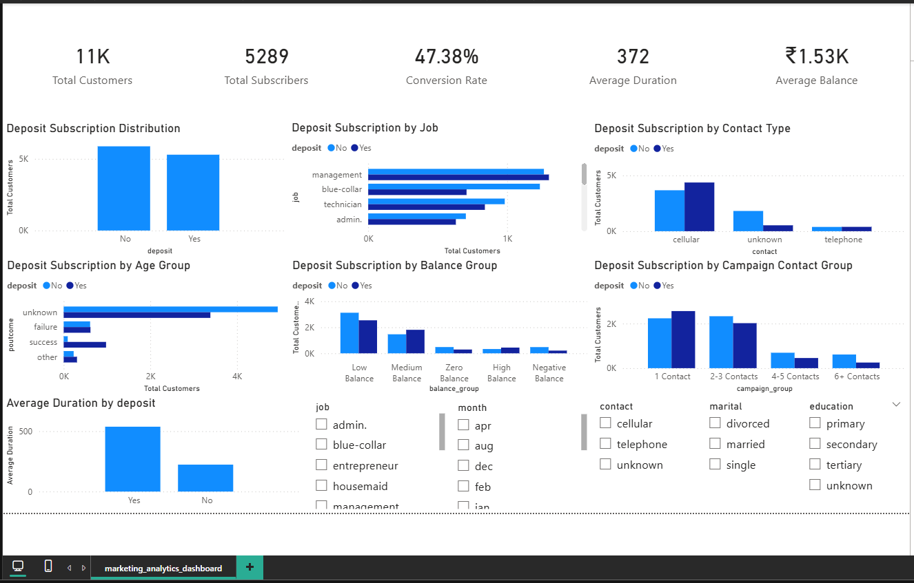

# 📊 Marketing Analytics: Campaign Performance and Customer Conversion Analysis

## 🔍 Overview

This project analyzes customer data from a marketing campaign to identify key factors influencing customer conversion and campaign effectiveness. The goal is to generate actionable insights that help improve targeting strategies and marketing performance.

---

## 🎯 Objectives

* Analyze customer demographics and financial behavior
* Evaluate marketing campaign performance
* Identify factors influencing customer deposit subscription
* Generate business insights and recommendations

---

## 🛠️ Tools & Technologies

* Python (Pandas, NumPy, Matplotlib, Seaborn)
* Power BI (Dashboarding & Visualization)
* Excel

---

## 📁 Dataset Description

The dataset contains customer information including:

* Demographics (age, job, marital status, education)
* Financial data (account balance, loans)
* Campaign details (contact type, duration, number of contacts)
* Previous campaign outcomes
* Target variable: **Deposit (Yes/No)**

---

## 📊 Key Insights

* Customers with previous successful campaign interactions show extremely high conversion rates
* Cellular communication is significantly more effective than other contact methods
* Students and retired individuals demonstrate higher conversion rates
* Higher account balances are associated with increased likelihood of subscription
* Call duration is strongly correlated with successful conversion
* Increasing campaign contacts does not always improve conversion

---

## 💼 Business Recommendations

* Target customers with previous successful campaign history
* Prioritize cellular communication channels
* Focus on high-performing customer segments (students, retired, management)
* Improve engagement during calls to increase conversion probability
* Avoid excessive repeated contact to optimize campaign efficiency

---

## 📊 Dashboard

The Power BI dashboard includes:

* Conversion Rate KPIs
* Customer segmentation analysis
* Campaign performance insights
* Interactive filters for deeper exploration

---

## 📌 Conclusion

This project demonstrates how data-driven insights can enhance marketing strategies by identifying high-value customer segments, optimizing communication methods, and improving overall campaign effectiveness.

---
## Sales Dashboard Preview

## 

## [Google Drive Link](https://drive.google.com/drive/folders/1i2GPKsU-tVJ0iS4aDkf33IzPHJfqR7hm?usp=sharing)

